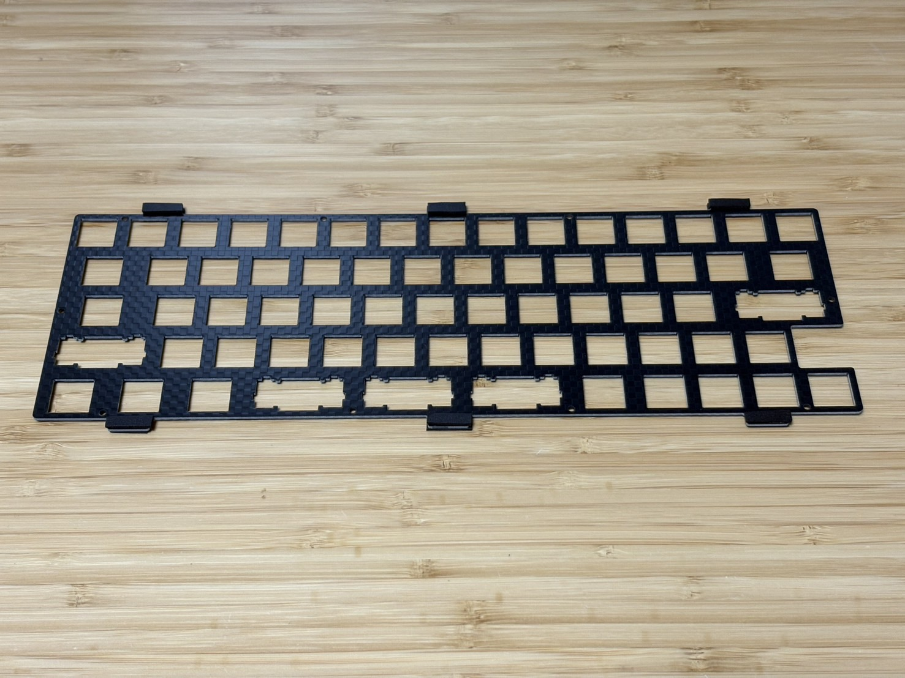
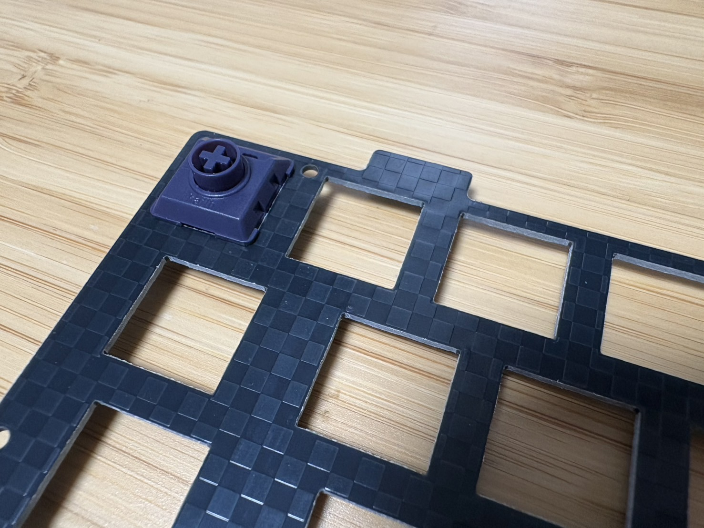
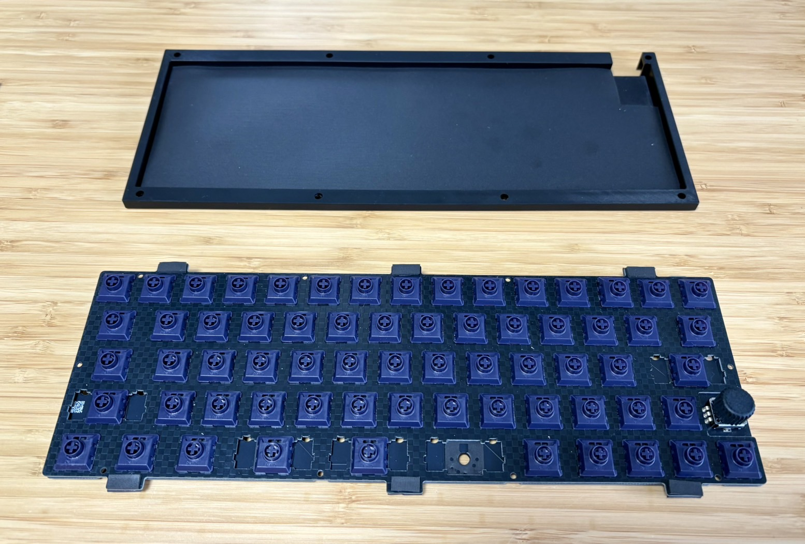
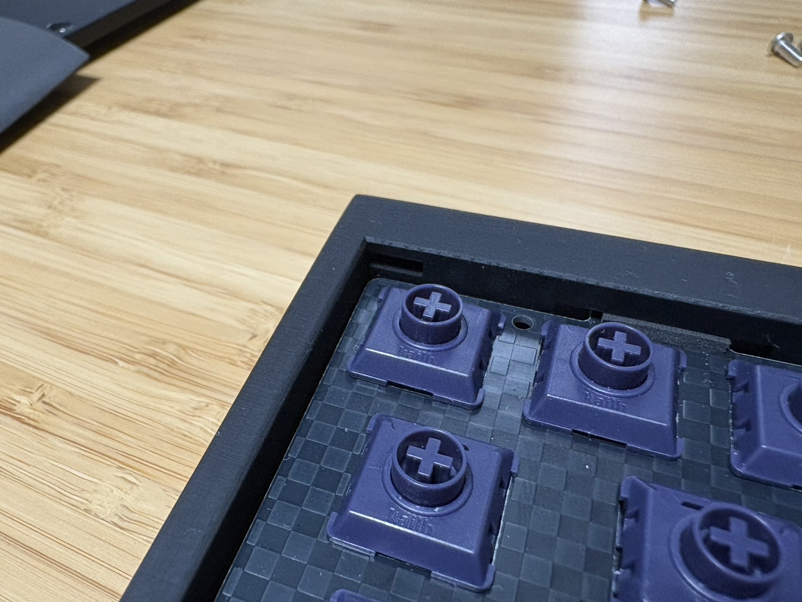
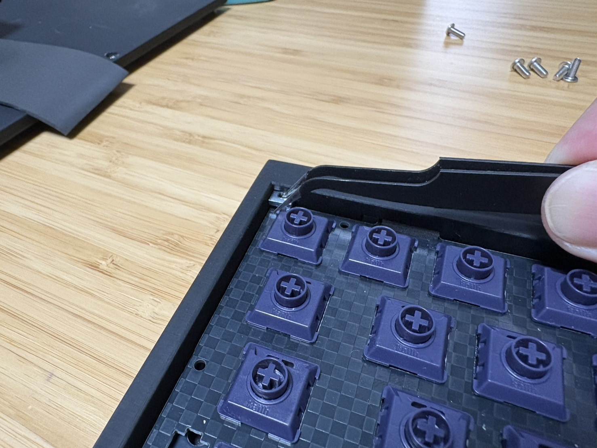
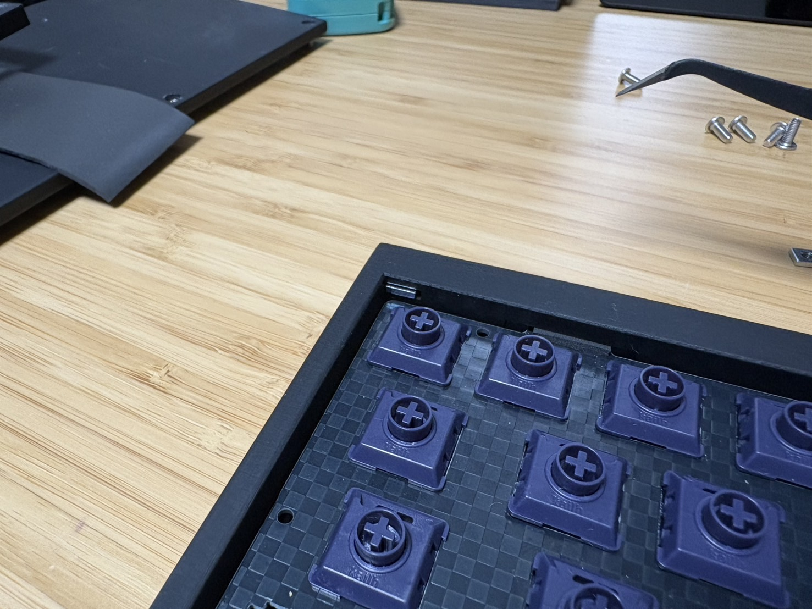

# GT67ビルドガイド
自作キーボードキットGT67のビルドガイドです。 
はんだ付け済み、ケース付き、ファームウェア書き込み済みですので、
ネジを締めて頂くだけでお使い頂けます。

## キット内容

| 名称                   | 数  |　補足                                  |
| ---------------------- | --- | ---                                   |
| メイン基板              | 1   |マイコンやロータリーエンコーダなど実装済み |
| FR-4製トッププレート    | 1   |                                        |
| レジン製ケース(ボトム)   | 1   |                                       |
| レジン製ケース(トップ)   | 1   |                                       |
| ガスケット用フォーム     |  -  |ケース及び基板の必要個所に取付済み        |
| ネジ                   | 8   |                                       |
| 四角ナット              | 8   |                                       |

## キット以外に必要なもの

| 名称                     | 数  |　補足         |
| ----------------------   | --- | ---          |
| キースイッチ              | 66  |choc v2互換　　|
| キーキャップ              | 66  |choc v2互換　　|
| ロータリーエンコーダノブ   | 1   |Daily Craft KeyboardさんのMINIがおすすめです           　　|
| PC接続用USB Type Cケーブル| 1   |　           　|

## 組み立て手順
まずトッププレートにスイッチをつけていきます。 
 

全て装着したらメイン基板にはめます。 
右図のように市販のスイッチパッドをメイン基板に貼ると打鍵音がよりマイルドになると思います。 

次にボトムケース、メイン基板＋トッププレート、トップケースの順に重ねてねじを締めます。 
上部からネジがみえないように、トッププレート内部に四角ナットを埋め込みます。 
 
少し細かい作業になるので、ピンセットがあるとやりやすくなると思います。
 

最後にボトム側からネジを締めれば完成です。
上部4か所にナットを入れてねじを締めた後に、下部4か所にナットを入れてねじを締める、という順が作業しやすいと思います。 

## 初期キー配置

